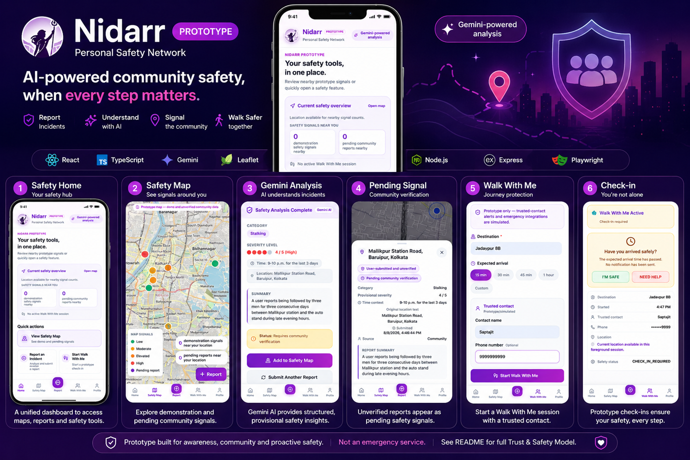
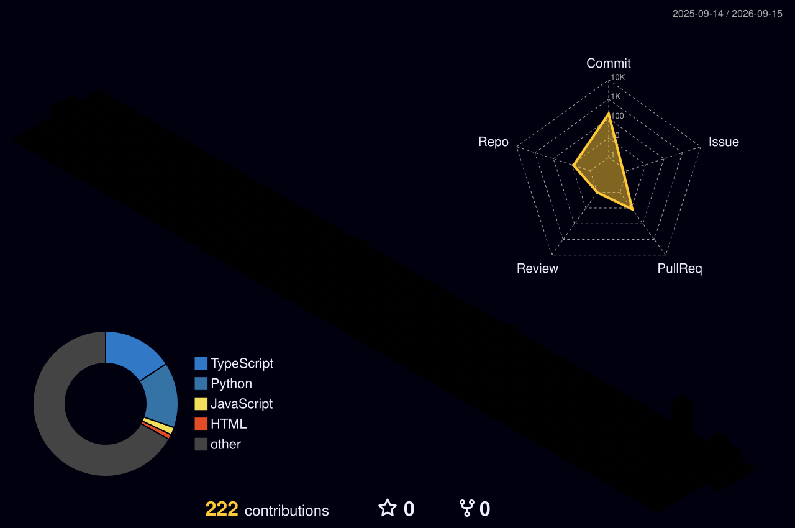

<div align="center">


  <a href="https://saptajitsaha.vercel.app/"></a>
  <a href="https://www.linkedin.com/in/saptajitsaha/"></a>
  <a href="https://x.com/Saptajit_Saha_"></a>
  <a href="mailto:sahasaptajit@gmail.com"></a>

<p>
  
</p>


</div>

---

<div align="center">

## `> whoami`

```text
┌──────────────────────────────────────────────────────────────┐
│ $ whoami                                                     │
│                                                              │
│  SaptajitSaha                                                │
│  ──────────────────────────────────────────────────────────  │
│  ROLE       → 2nd Year @ IIT Madras                          │
│  DEGREE     → BS in Data Science & Applications              │
│  TARGET     → Data Scientist / ML Engineer                   │
│  INTERESTS  → Data Science • AI/ML                           │
│  BUILDING   → Useful products, not just demos                │
│  OFFLINE    → Vibecoding • Running • Powerlifting            │
│                                                              │
│  status: learning                                            │
│  mode:   building                                            │
└──────────────────────────────────────────────────────────────┘
```
  
> I like turning messy ideas into things people can actually use. Right now, I'm sharpening my foundations in data, statistics, programming and machine learning while building products along the way.

</div>

---

## `// things i care about`

<p align="center">
  
  
  
  
</p>

---

## `01 / featured build`

<div align="center">

<a href="https://github.com/SaptajitSaha/Nidarr">
  
</a>

<br />

<a href="https://github.com/SaptajitSaha/Nidarr">
  
</a>

### [Nidarr](https://github.com/SaptajitSaha/Nidarr)

**AI-powered community safety platform for incident reporting, safety signals and proactive personal safety.**

<div align="center">
  
  
  
  
</div>

</div>

Nidarr is a **hackathon prototype**, not a production safety service. Its current implementation combines structured incident reporting, provisional Gemini analysis, user-confirmed locations, a safety map, and foreground-only journey check-ins. The project explicitly separates fictional demonstration signals, provisional AI analysis and unverified community submissions.

[Read the repository →](https://github.com/SaptajitSaha/Nidarr)

---

## `02 / tech stack`

<div align="center">

### Programming

<div align="center">

<p>Python · C++ · Rust · JavaScript · TypeScript · Kotlin</p>
</div>

### ML / AI

<div align="center">
  
  
  
  
</div>

<p>XGBoost · MediaPipe · YOLO · Deep Learning · Generative AI · Large Language Models</p>

### Data / Engineering

<div align="center">

</div>

<p>Express · Vite · Streamlit · PySide6 · REST APIs · CI/CD · Cloud Run · pytest · Playwright</p>

</div>

<br />

---

## `03 / 3D contribution graph`

<div align="center">



</div>

<br />

## `03 / contribution.exe`

<div align="center">

<picture>
  <source media="(prefers-color-scheme: dark)" srcset="https://raw.githubusercontent.com/SaptajitSaha/SaptajitSaha/output/github-contribution-grid-snake-dark.svg" />
  <source media="(prefers-color-scheme: light)" srcset="https://raw.githubusercontent.com/SaptajitSaha/SaptajitSaha/output/github-contribution-grid-snake.svg" />
  
</picture>

</div>

<div align="center">

### streak.pet

<a href="https://nomlings.cc/badge/SaptajitSaha">
  
</a>

</div>

---

## `04 / github telemetry`

<div align="center">


<br /><br />



### Recent activity

<!--RECENT_ACTIVITY:start-->
│ 1. ⬆️ Pushed undefined commit(s) to [SaptajitSaha/SaptajitSaha](https://github.com/SaptajitSaha/SaptajitSaha)<br>
│ 2. ⬆️ Pushed undefined commit(s) to [SaptajitSaha/SaptajitSaha](https://github.com/SaptajitSaha/SaptajitSaha)<br>
│ 3. ⬆️ Pushed undefined commit(s) to [SaptajitSaha/SaptajitSaha](https://github.com/SaptajitSaha/SaptajitSaha)<br>
│ 4. ⬆️ Pushed undefined commit(s) to [SaptajitSaha/SaptajitSaha](https://github.com/SaptajitSaha/SaptajitSaha)<br>
│ 5. ⬆️ Pushed undefined commit(s) to [SaptajitSaha/SaptajitSaha](https://github.com/SaptajitSaha/SaptajitSaha)<br>
│ 6. ⬆️ Pushed undefined commit(s) to [SaptajitSaha/SaptajitSaha](https://github.com/SaptajitSaha/SaptajitSaha)<br>
<!--RECENT_ACTIVITY:end-->

<!--RECENT_ACTIVITY:last_update-->
Last updated: Sunday, September 13th, 2026, 6:27:16 AM
<!--RECENT_ACTIVITY:last_update_end-->

### WakaTime coding stats

<!--START_SECTION:waka-->

```txt
Other    6 hrs 51 mins         ████████████████████████░   95.76 %
Python   18 mins               █░░░░░░░░░░░░░░░░░░░░░░░░   04.24 %
```

<!--END_SECTION:waka-->


</div>

---

## `06 / certifications`

| Certification / Credential | Issuer |
|---|---|
| Goldman Sachs – Internal Audit Job Simulation | Forage |
| Deloitte Australia – Data Analytics Job Simulation | Forage |
| Introduction to Internet of Things | IIT Bombay |
| Remote Sensing Data Analytics for Crop Production Forecasting | IIRS / ISRO |
| Amazon AWS Summit 2025 | AWS |
| HP LIFE – Setting Prices | HP LIFE |
| Introduction to Physical Computing | Lancaster University |
| Python for Everybody Specialization | University of Michigan |

---

## `07 / academic snapshot`

<div align="center">
  
  
  
  
  
</div>

**2023:** Certificate of Appreciation for Outstanding Academic Performance after the Secondary Examination.

---

## `08 / find me elsewhere`

<div align="center">

<a href="https://www.youtube.com/@ig.fr1cko"></a>
<a href="https://www.kaggle.com/saptajitsaha"></a>
<a href="https://leetcode.com/u/Saptajit_Saha/"></a>
<a href="https://codeforces.com/profile/sahasaptajit"></a>
<a href="https://instagram.com/saptajit.py/"></a>
<a href="https://medium.com/@sahasaptit"></a>
<a href="https://dev.to/saptajitsaha"></a>
<a href="https://discord.com/users/fricko_yt"></a>

</div>

---


<div align="center">

<a href="https://github.com/SaptajitSaha">
  
</a>

`Built with curiosity. Powered by orange.` 🟧

</div>

---

<div align="center">

## `currently vibing`

<a href="https://open.spotify.com/user/31woaxwhxdzembeh5htuahpqz4x4">
  
</a>

</div>
