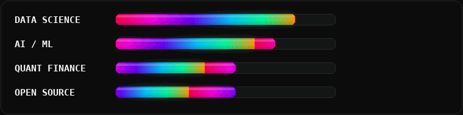
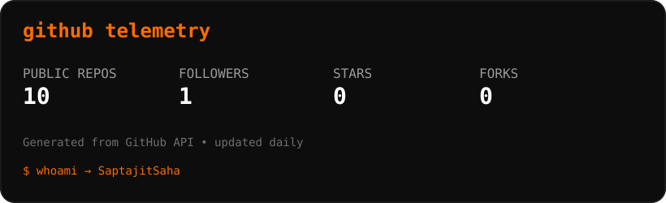
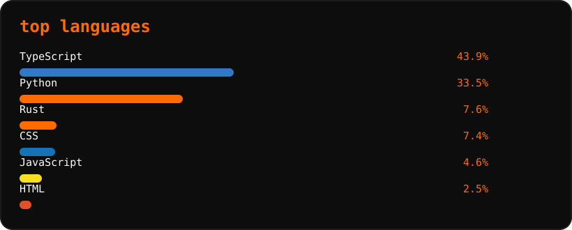
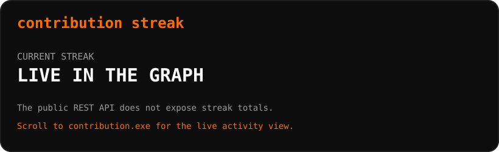
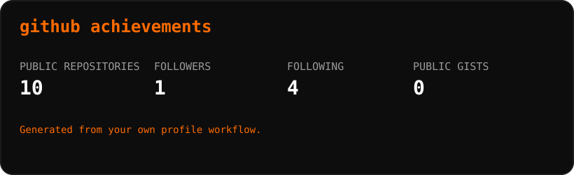

<div align="center">

#  Saptajit Saha

### `Data Scientist / ML Engineer in the making`

<p>
  <a href="https://saptajitsaha.vercel.app/"></a>
  <a href="https://www.linkedin.com/in/saptajitsaha/"></a>
  <a href="https://x.com/Saptajit_Saha_"></a>
  <a href="mailto:sahasaptajit@gmail.com"></a>
</p>

<p>
  
</p>


</div>

---

## `> whoami`

```text
┌──────────────────────────────────────────────────────────────┐
│  SaptajitSaha                                               │
│  ──────────────────────────────────────────────────────────  │
│  🎓  2nd Year @ IIT Madras                                 │
│  🧠  BS in Data Science & Applications                     │
│  🎯  Aspiring Data Scientist / ML Engineer                  │
│  🧪  Interested in Data Science • AI/ML • Quant Finance    │
│  🛠️  Building useful products, not just demos              │
│  ⚡  Vibecoding • Running • Powerlifting                    │
└──────────────────────────────────────────────────────────────┘
```

> I like turning messy ideas into things people can actually use. Right now, I'm sharpening my foundations in data, statistics, programming and machine learning while building products along the way.

### `focus.exe`

<div align="center">
  
</div>

> The bars are intentionally a vibe, not a fake skill-ranking system.

---

## `// things i care about`

<p align="center">
  
  
  
  
  
</p>

---

## `01 / featured build`

<div align="center">

<a href="https://github.com/SaptajitSaha/Nidarr">
  
</a>

<br />

<a href="https://github.com/SaptajitSaha/Nidarr">
  
</a>

### [Nidarr](https://github.com/SaptajitSaha/Nidarr)

**AI-powered community safety platform for incident reporting, safety signals and proactive personal safety.**

`React` `TypeScript` `Vite` `Express` `Gemini` `Leaflet` `OpenStreetMap`

</div>

Nidarr is a **hackathon prototype**, not a production safety service. Its current implementation combines structured incident reporting, provisional Gemini analysis, user-confirmed locations, a safety map, and foreground-only journey check-ins. The project explicitly separates fictional demonstration signals, provisional AI analysis and unverified community submissions.

[Read the repository →](https://github.com/SaptajitSaha/Nidarr)

---

## `02 / tech stack`

<div align="center">

### Languages & Data


### Data / Analytics / ML


### Tools & Platforms


</div>

**Working with:** Python, SQL, C/C++, JavaScript, Pandas, NumPy, Matplotlib, Seaborn, Power BI, Tableau, Looker Studio, Excel, Google Sheets, Git/GitHub, Jupyter, VS Code and Google Cloud.

---

## `03 / github telemetry`

<div align="center">









</div>

> These cards are generated by GitHub Actions and committed into this repository, so the profile does not depend on the paused public `github-readme-stats` / trophy Vercel deployments.

---

## `04 / contribution.exe`

<div align="center">

<picture>
  <source media="(prefers-color-scheme: dark)" srcset="https://raw.githubusercontent.com/SaptajitSaha/SaptajitSaha/output/github-contribution-grid-snake-dark.svg" />
  <source media="(prefers-color-scheme: light)" srcset="https://raw.githubusercontent.com/SaptajitSaha/SaptajitSaha/output/github-contribution-grid-snake.svg" />
  
</picture>

</div>

---

## `05 / currently vibing`

<div align="center">

<a href="https://open.spotify.com/user/31woaxwhxdzembeh5htuahpqz4x4">
  
</a>

</div>

---

## `06 / certifications`

| Certification / Credential | Issuer |
|---|---|
| Goldman Sachs – Internal Audit Job Simulation | Forage |
| Deloitte Australia – Data Analytics Job Simulation | Forage |
| Introduction to Internet of Things | IIT Bombay |
| Remote Sensing Data Analytics for Crop Production Forecasting | IIRS / ISRO |
| Amazon AWS Summit Certificate 2025 | AWS |
| HP LIFE – Setting Prices | HP LIFE |
| Introduction to Physical Computing | Lancaster University |
| Python for Everybody Specialization | University of Michigan |

---

## `07 / academic snapshot`

<div align="center">


</div>

**2023:** Certificate of Appreciation for Outstanding Academic Performance after the Secondary Examination.

---

## `08 / find me elsewhere`

<div align="center">

<a href="https://www.youtube.com/@ig.fr1cko"></a>
<a href="https://www.kaggle.com/saptajitsaha"></a>
<a href="https://leetcode.com/u/Saptajit_Saha/"></a>
<a href="https://codeforces.com/profile/sahasaptajit"></a>
<a href="https://instagram.com/saptajit.py/"></a>
<a href="https://medium.com/@sahasaptajit"></a>
<a href="https://dev.to/saptajitsaha"></a>
<a href="https://discord.com/users/fricko_yt"></a>

</div>

---

## `09 / a little more human`

```text
RUNNING       ██████████████████░░
VIBECODING    ███████████████████░
POWERLIFTING  ████████████████░░░░

status: learning
mode: building
coffee: probably
bugs: definitely
```

<div align="center">

<a href="https://mynickname.com/id1846535"></a>

</div>

---

## `10 / contact`

```bash
$ echo "Want to build something useful?"
> sahasaptajit@gmail.com
```

<div align="center">

### `while(alive) { learn(); build(); repeat(); }`

</div>

---

<div align="center">

<a href="https://github.com/SaptajitSaha">
  
</a>

<br><br>

`Built with curiosity. Powered by orange.` 🟧

</div>
